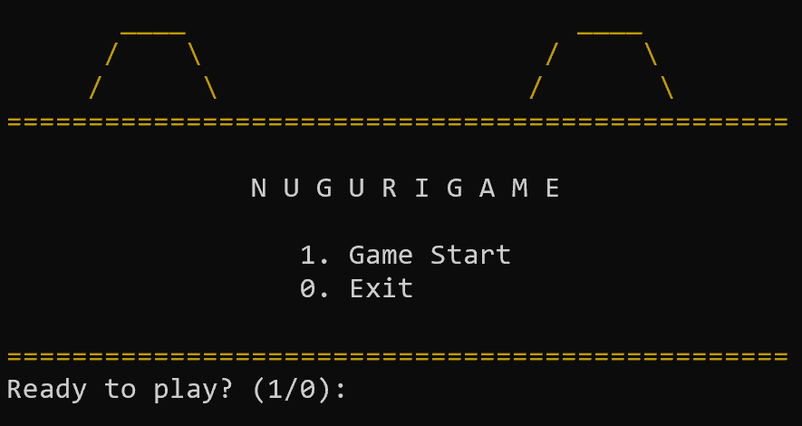
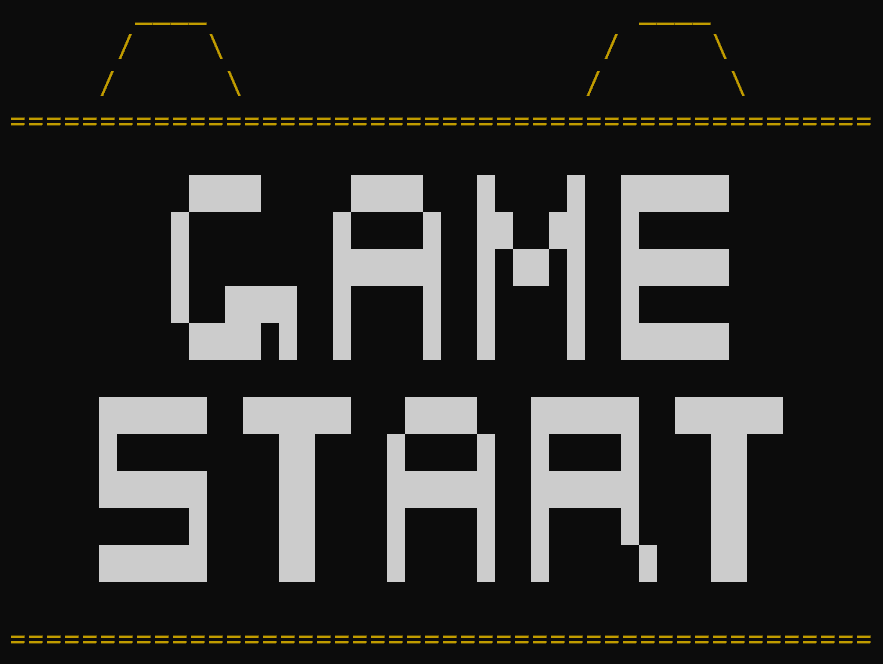
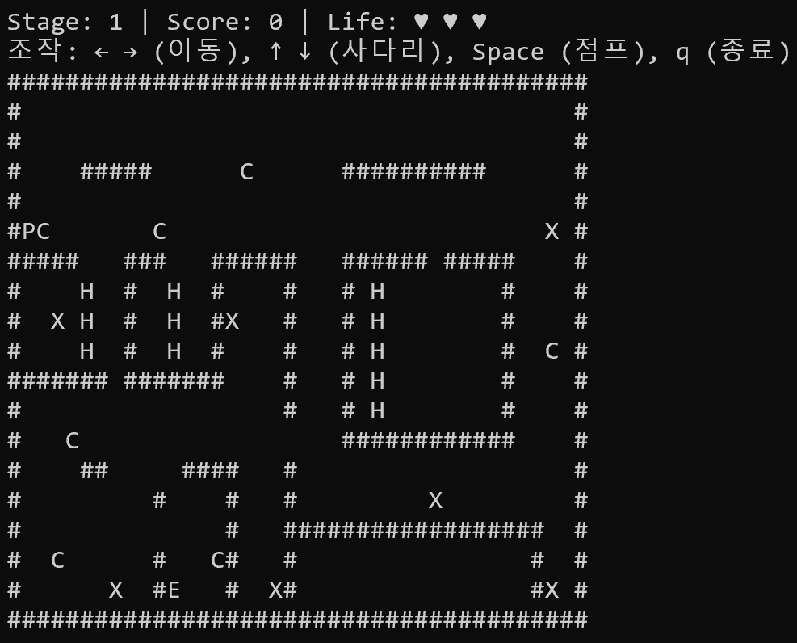
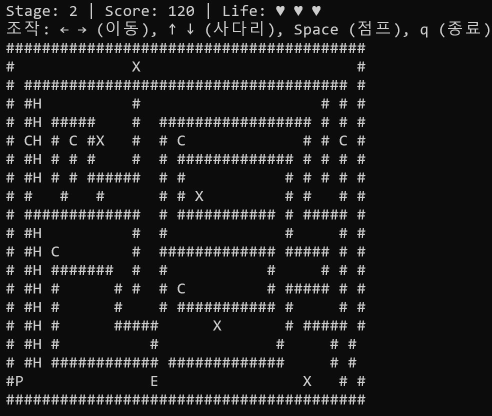
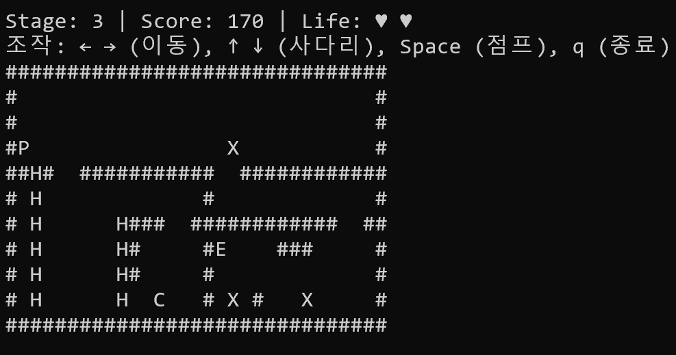
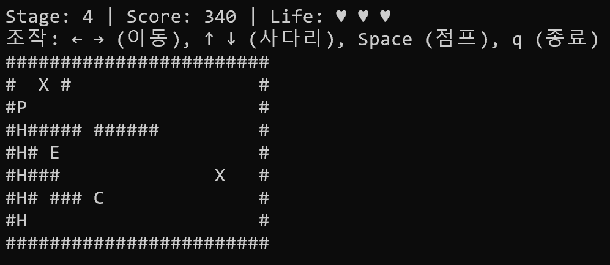
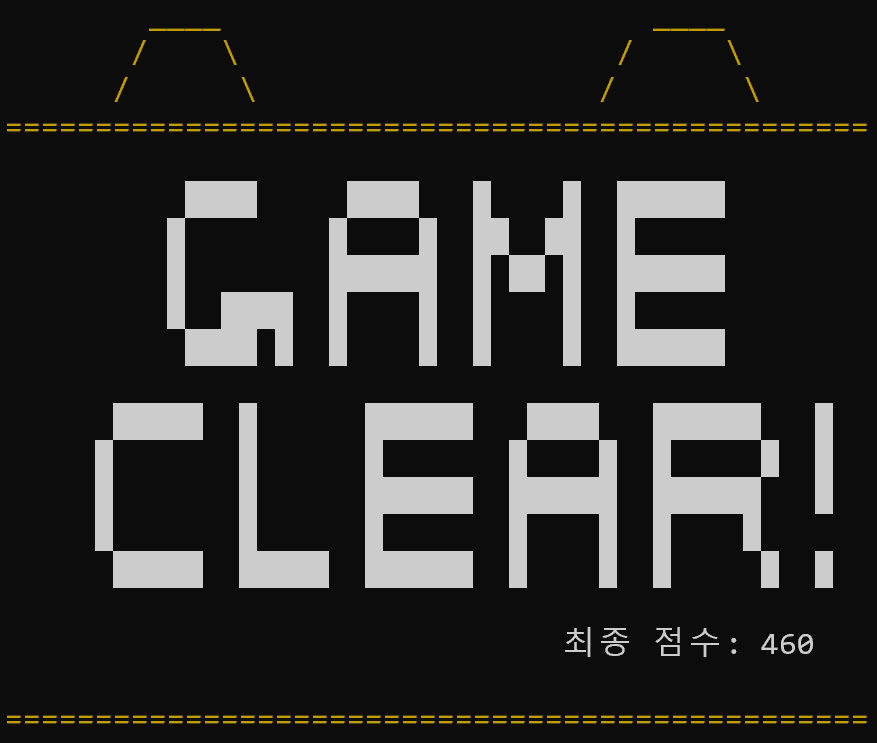

# ADS2_Nuguri - 너구리 게임  
고급자료구조 18조 · C 언어 기반 크로스플랫폼 콘솔 게임

---

## 1. 프로젝트 개요

- **프로젝트명**: ADS2_Nuguri  
- **설명**: C 언어로 구현한 콘솔 액션 게임 (Windows / Linux / macOS 크로스플랫폼 지원)  
- **언어 / 환경**: C, 콘솔(cmd, 터미널) 기반, 크로스플랫폼
  
### 고급자료구조 18조
- **팀장**: 20170210 안선효
- **조원**:  20223111 배준희, 20243096 문서희, 20243132 제송현
- **GitHub 링크**: https://github.com/He6venly/ADS2_Nuguri

---

## 2. O/S 컴파일 & 실행 방법 및 크로스플랫폼 전략

### 2.1 크로스플랫폼 설계 구조

본 프로젝트는 **동일한 소스 코드**를 기반으로 Windows, Linux, macOS에서 모두 컴파일 및 실행되도록 설계되었다.  
C 전처리기 매크로(`#if defined(...)`)를 이용해 OS별로 다른 부분만 분기 처리한다.
- 또한 Text_Diablo 과제처럼 **게임 내부 로직에서는 `clrscr`, `getch`, `kbhit` 등등의 정의된 함수를 OS에 구애받지 않고 자유롭게 호출하여 사용**할 수 있게 함수이름 또한 전처리 해둠.

#### ✅ Windows (`_WIN32`)

- **주요 헤더**
  - `windows.h`, `conio.h`
- **콘솔 제어**
  - `SetConsoleOutputCP(65001)`으로 콘솔 코드 페이지(인코딩)를 강제로 **UTF-8**로 설정
  - `CONSOLE_CURSOR_INFO` 구조체를 활용해 커서 숨김 / 표시
- **입력 처리**
  - `_getch()`, `_kbhit()`로 비동기 입력 처리

#### ✅ Linux / macOS (`__linux__` 등)

- **주요 헤더**
  - `unistd.h`, `termios.h`, `fcntl.h`
- **콘솔 제어**
  - ANSI 이스케이프 코드 (`\x1b[H`, `\x1b[?25l` 등)를 사용해 화면 및 커서 제어
- **입력 처리**
  - `termios`로 **Raw Mode(비정규 모드)** 설정
  - `fcntl`로 **Non-blocking Input** 설정 → `kbhit()` 직접 구현

---

### 2.2 컴파일 & 실행 가이드

#### 🔵 Windows

> **권장 환경**: MinGW(GCC)가 설치된 windows 명령 프롬프트 또는 Visual Studio 컴파일러 도구

1. 터미널(CMD / PowerShell)을 관리자 모드로 열고 소스 코드가 있는 디렉토리로 이동한다.  
2. 아래 명령으로 컴파일한다.

```bash
gcc nuguri.c -o nuguri.exe
```

3. 실행:

```bash
./nuguri.exe
```

---

#### 🟢 Linux / macOS

> **필수 요소**: GCC만 설치되어 있으면 추가 라이브러리 없이 컴파일 가능

1. 터미널을 열고 소스 코드가 있는 디렉토리로 이동한다.  
2. 아래 명령으로 컴파일한다.

```bash
gcc nuguri.c -o nuguri
```

3. 실행:

```bash
./nuguri
```

---

## 3. 구현 기능 리스트 및 인게임 구성

### 3.1 주요 기능 요약

| 구분       | 기능(Feature)            | 구현 내용(Implementation Detail) |
|--------------|--------------------------|----------------------------------|
| UI 설계   | 타이틀 및 게임오버 UI    | 타이틀, 오프닝, 게임 오버 및 클리어까지 4가지의 UI를 구성. 게임 오버 시 Y/N 입력으로 재시작 선택 부여  |
| 자료구조   | 동적 맵 할당             | `char ***`(3중 포인터)로 MAP을 두번 읽어오는 방식으로 **스테이지 × 높이 × 너비**를 메모리에 동적 할당 |
| 물리 엔진  | 점프 / 중력 / 관성 이동  | 하강 시 **간단한 중력 가속도** 구현 및 점프 시 간단한 **방향지정 점프 구현(포물선)** 과 제자리 점프 중 **공중에서 방향 전환** 추가 |
| 렌더링     | 화면 깜빡임(플리커링) 최소화 | `system("cls")` 대신 커서 0,0으로 초기화 후 **전체 덮어쓰기** 방식 |
| 적 이동 AI | 적(Enemy) 이동 패턴      | isGround 변수로 땅 몬스터와 공중 몬스터의 이동 로직 분리. 낭떠러지 감지 및 벽이면 방향 전환 |
| 충돌 처리  | 벽/적/코인 충돌          | 이동 경로 전체 검사로 **벽 관통(tunneling)** 방지, 전체 검사로 인한 시각적으로 멀리서 사망하는 판정 개선 |
| 입력       | 비동기 키 입력           | Windows: `_kbhit()` / Linux: `termios + fcntl`로 직접 구현 |
| 시스템     | 크로스플랫폼            | Windows 콘솔 UTF-8(65001) 강제, 리눅스/맥은 기본 UTF-8 활용.|
| 사운드     | Beep 기반 효과음         | <Windows.h> 헤더의 `Beep(f, d)` 활용 / Linux: 커스텀 `Beep` 재사용으로 이벤트별 효과음 구현 |


---

### 3.2 인게임 화면 구성










---


## 4. UI 설계 및 게임 흐름

기존의 맵만 출력하는 구조에서 **게임 시작 → 플레이 중 → 게임 오버/클리어 → 재시작 여부 선택**까지 하나의 흐름으로 이어지는 UI를 설계함.
주요 UI 구성 및 게임 전체 흐름은 다음과 같음.

  1. `title()`
     → 게임 시작 여부 선택 (1/0)
  2. `openingUI()`
     → 인트로 화면 후 본 게임 진입
  3. `draw_game()`
     → HUD + 조작 안내 + 맵을 한 번에 표시
  4. `gameoverUI()` + `restart_game()`
     → 게임 오버 후 점수 확인 및 재시작 여부 선택
  5. `gameclearUI()`
     → 모든 스테이지 클리어 시 엔딩 화면 및 최종 점수 확인

---

### 4.1 타이틀 & 게임 시작 UI

#### 4.1.1 타이틀 화면 `title()`

- 게임 실행 시 가장 먼저 호출되는 함수로, **게임의 메인 타이틀 역할**을 함.
- 콘솔을 지우고(clrscr), `textcolor()`와 printf로 **NUGURI GAME 로고** 표시후 선택지 제공.
    - `1. Game Start`
    - `0. Exit`
- `kbhit()`와 `getch()`를 이용해서 **1/0 입력을 받을 때까지 대기**하며,
  - `1`을 누르면 `openingUI()`를 호출한 뒤 `1`을 반환 (게임 시작)
  - `0`을 누르면 `0`을 반환 (프로그램 종료)

#### 4.1.2 오프닝 화면 `openingUI()`

- 타이틀에서 `1`을 선택했을 때 한 번만 보여주는 **게임 시작 인트로 화면**임.
- 로고와 “NUGURI GAME”을 ASCII 아트로 크게 출력한 뒤,
  - 잠시 감상할 수 있도록 `getch()`로 **하나의 키 입력을 기다린 뒤** 본 게임으로 넘어감.
- 바로 시작하지 않고 텀을 주어 타이틀 → 오프닝 → 본 게임 순서로 흐름을 구성해 **게임에 들어가는 느낌**을 살려봄.

---

### 4.2 게임 오버 UI 및 재시작 로직

#### 4.2.1 게임 오버 화면 `gameoverUI(final_score)`

- 플레이어의 목숨이 0이 되어 게임오버되면 진입.
- 콘솔을 지운 뒤, 게임오버 UI 출력 후 하단에 **최종 점수** 표시
- 마지막 줄에 - `RESTART? (Y/N) :`를 출력해 사용자 입력으로 즉시 재시작 가능하게 함.

#### 4.2.2 재시작 선택 `restart_game(int *game_over)`

- `restart_game()` 함수는 내부에서 `gameoverUI(score)`를 먼저 호출하여  
  **게임 오버 화면을 보여준 후**, 플레이어의 선택에 따라 다음을 결정.

- 키 입력 처리
  - `kbhit()`로 입력이 들어올 때까지 대기
  - `Y / y` 입력 시 (대소문자 구분 X)
    - 점수, 목숨, 스테이지, 플레이어 위치 등 **게임 구성 정보 변수들을 초기화**
  - `N / n` 입력 시
    - `*game_over = 1;` 로 설정하여 메인 루프를 종료 (프로그램 종료 방향)

---

### 4.3 게임 클리어 UI — `gameclearUI(final_score)`

- 모든 스테이지를 클리어했을 때 호출되는 **엔딩 화면**이다.
- 게임 오버 UI와 동일하게, 상단에 ASCII 아트로 “CLEAR / 축하 메시지”를 크게 출력하고, 하단에 **최종 점수**를 함께 표시한다.
- 마지막에는 `getch()`로 키를 한 번 입력받은 뒤 종료하게 해서 화면 확인 여유를 줌.

---

## 5. 개발 중 발생한 핵심 문제 & 해결 과정

### 5.1 맵 데이터 define으로 고정 배열 → 동적 메모리 구조로 개선

**문제점**

- 초기 구현: `define MAP_WIDTH = 40`과 같이 **고정 크기 3차원 배열** 사용
- 스테이지 수나 맵 크기를 바꾸려면 **코드를 직접 수정**해야 함
- 실제보다 더 큰 배열을 잡아 메모리 낭비 발생

**해결 방법**

1. **1차 스캔 `scanMapSize()`**
   - 맵 파일을 대략적으로 한 번 먼저 읽는 함수
     - 최대 너비, 최대 높이, 스테이지 개수 등을 추출해내기 위함

2. **2차 스캔 `dynamicMap()` 및 동적 할당**
   - 1차 스캔으로 맵 파일의 속성을 담아둔 지정된 전역변수 maxWidth, maxHeight .... 등을 사용하여 동적으로 맵 할당
   - `char ***map` 형태로
     - `map[stage][HEIGHT][WIDTH]` 스테이지 > 높이(라인수) > 길이(한 라인 길이) 순서로 접근 가능하도록 3중 포인터로 구성
     -  각 차원당 필요 크기만큼만 `malloc` 사용
   
3. **정리 함수 분리**
   - `dynamicMap_free()` 라는 동적 맵 할당 해제 함수를 만들어, 게임 종료 시
     - 한 줄 배열 → 각 줄의 포인터 배열 → 스테이지 포인터 배열 순서로 `free` 
   - 메모리 누수 방지를 위함.

---

### 5.2 화면 깜빡임(Flickering)과 커서 잔상 문제

**문제점**

- draw_map() 함수에 매 화면 갱신마다 `system("cls")`가 사용되고 있어,
  - 화면 전체가 지워졌다 다시 그려져 **심한 깜빡임** 발생
  - 커서 위치도 계속 바뀌면서 왔다갔다하여 신경쓰임 -> 플레이 감각 저하

**해결 방법**

- **커서 시작위치 이동 + 덮어쓰기** 방식으로 전환
  - `\x1b[H`(홈(시작) 위치 = 좌표 0,0)로 커서를 옮긴 뒤
  - 전체 화면 내용을 다시 한 번 출력하여 갱신
- **커서 숨김 처리**
  - Windows: <window.h>의 헤더의 내장 구조체인 `CONSOLE_CURSOR_INFO`로 커서 세팅 변경.
    - `bVisible = FALSE` 후 `SetConsoleCursorInfo()`로 핸들에 전달.
  - Linux/macOS: `\x1b[?25l`로 커서 숨김, 종료 시 `\x1b[?25h`로 복구
    - ?25 << 커서를 지칭하는 고유 번호, 뒤에 붙는 h는 켜기 (high), l(low)는 끄기를 의미함.

---

### 5.3 점프 관련 로직 수정 + 방향 점프(관성) 이동 시 충돌 버그

**문제점**

- 점프하면서 좌우 이동(공중 컨트롤)을 할 때
  - 대각선 이동 경로에 벽이나 적이 있으면
  - 드물게 벽을 관통하거나, 공중에서 시각적으로 부자연스럽게 사망하는 현상 발생

**원인**

- 좌표를 한 번에 갱신한 뒤 한 번만 충돌을 검사하는 방식
- 한 프레임에 2칸 이상 이동할 때 **중간 칸의 충돌**을 놓치는 이유였음.


**해결 방법**
- 1. **enemyCheck라는 0,1 T/F표현 변수 추가**
  - why?) 내 밑이 바닥(#)이 아닌 기준의 충돌 로직 검사시마다
  - 1-1. 내가 지금 몬스터 충돌까지 생각할지 (바닥에 닿을때나 사다리 타있을때와 같이 **바닥에서 떨어져 있지만 충돌 감지는 되어야 할** 경우)
  - 1-2. 단순히 점프중이라 공중(경로)이기에 몬스터와의 충돌은 내 몸이 바닥에 닿으면 할 거니까 **코인만 검사**하면 될지 분기를 정하기 위함.
  - 이동 로직 함수에서 충돌 검사 함수를 불러 쓸 때마다 몬스터 검사를 할지 안 할지를 0과 1로 제어하는 방식으로 해봤음.

  - 점프 검사중 일부
  ```c
                check_collisions(player_x, player_y, game_over, 1); // 착지할때 적 있으면 죽어야하니 1

                break; //종료
            } // -> 결론 : 떨어질 때 가속도 붙으면 한번에 여러칸 이동 -> 이동하는 칸 사이만큼 반복하면서 벽 감지하면 벽 위에 멈춤

            check_collisions(player_x, player_y + k, game_over, 0); // 그냥 낙하중일때는 코인만 검사하게
        }
    } 
    if (is_jumping) player_y = next_y; //점프중이면 그냥 다음 위치로
  ```
  - 와 같이 check_collisions 파라미터로 0, 1을 보내서 몬스터 충돌 검사를 시행할지 여부를 보내서 방향점프 후 도착경로 예측으로 인해 공중에서 몬스터 충돌 판정으로 죽어버리는 버그 없앰.

2. **축 분리 이동**
   - Y축(점프/낙하) 이동 → 충돌 검사
   - X축(좌우 이동) 이동 → 충돌 검사
   - 순차적으로 처리해 벽 관통 방지
3. **이동 경로 전체 검사**
   - `for` 루프로 이동 거리 사이의 모든 좌표를 검사
   - 하나라도 벽이면 이동을 중단하고 해당 좌표 앞에서 멈춤
4. **적 충돌과 지형 충돌 분리**
   - 지형 충돌은 이동 전에, 적 충돌은 최종 위치 확정 후에 검사

---

### 5.4 OS별 입력 버퍼 & 인코딩 문제

#### 5.4.1 Linux / macOS 입력 지연

- 기본 터미널이 라인 버퍼라 엔터를 칠 때까지 입력이 전달되지 않는 문제 발생

**해결**

- `termios`에서 `ICANON`과 `ECHO` 플래그 해제 → Raw Mode  
- `fcntl`로 `O_NONBLOCK` 설정 → `kbhit()`와 비슷한 동작 직접 구현  

#### 5.4.2 Windows 콘솔 한글 깨짐

- Windows CMD 기본 코드 페이지: CP949  
- 소스 / 맵 파일은 UTF-8 → 한글/특수문자 깨짐

**해결**

- `main()` 초기에 `SetConsoleOutputCP(65001);` 호출로  
  - 콘솔 출력 코드 페이지를 UTF-8로 변경  

---

### 5.5 천장 관통(Tunneling)

**천장 관통 문제**

- 머리 바로 위에 벽이 있을 경우, 점프 시도 시 해당 벽을 통과하고 위로 올라가는 버그 발생  

**해결**

- 점프 검사가 끝난 후 이동 로직 처리할 때
  ```c
  if (velocity_y != 0) {
          if (next_y >= 0 && map[stage][next_y][player_x] != '#') {
              player_y = next_y; //따라서 그냥 점프
          } else {
              velocity_y = 0;
          }
  ```
  - 이동 검사 완료 후 **velocity_y이 0이 아니라면** 최종 이동하도록 if문 하나 더 생성
  - 벽이면 이미 위에서 velocity_y가 0이 되어있으니, 최종 이동을 하지않고 로직이 종료되는 구조.

### 4.6 몬스터 움직임 로직 개선 및 낭떠러지 처리
- isGround 변수를 이용.
```c
int isGround = enemies[i].y + 1 < MAP_HEIGHT && map[stage][enemies[i].y + 1][next_x] == '#';
```
- 내 바닥이 #이고 맵을 벗어나지 않으면 isGround를 1(true)로 설정하여 지상 몬스터로 분류
   
- 지상 몬스터는 발밑이 빈 공간이면 방향을 반대로 변경
- 공중 몬스터는 바닥이 빈 것과 무관하게 벽을 만날때만 방향 변경하며 X축을 자유롭게 이동하게 세팅

---

## 6. 기타 개선 사항

### 6.1 특정 상황의 입력 버퍼 쌓임 방지

**문제**
- 방향키를 꾹 누르다가 떼면, **버퍼에 남은 방향 입력** 때문에 캐릭터가 계속 움직이는 문제 발생

**해결**
- 메인 루프에서 남은 입력을 비워내 로직 추가.

```c
if(getch()) {
  while (kbhit()) getch() {
    ...
    c = temp;
    ...
  }
}
```
- 와 같이, while로 버퍼에 적재된 입력이 계속해서 쌓이지 않도록 while로 화면 갱신(한 프레임)마다 계속해서 c에 할당해서 마지막 입력만 유지. 
- 이로 인해 **가장 최신 입력만 반영**되도록 조정

---

### 6.2 게임 재시작(Replay) 시 상태 초기화

**문제**
- 게임 오버 후 재시작 시  
  - 이전 점수, 스테이지, 속성 값이 일부 유지되고, 재시작 후 사망 시 다시 묻지 않고 프로그램이 죽어버리는 문제 발견
 
**해결**
- `restart_game()`에서  
  - `score`, `life`, `stage` 등 모든 게임 구성 변수 상태를 초기 상태로 되돌림.
  - 그리고 y입력 분기 처리에서 *game_over 변수를 건드리고 있어서 이를 삭제하여 해결함.

---

## 7. 추가 기능 - 효과음 시스템 (Beep) 및 크로스플랫폼 처리

### 7.1 Beep 함수 전처리

- **Windows**
  - `<windows.h>`에서 제공하는 `Beep(int frequency, int duration)` 사용
  - `frequency` : 주파수(Hz), `duration` : 지속시간(ms) 로 구성됨.

- **Linux / macOS**
  - beep함수는 Windows.h의 내장함수라 이외의 OS에서 사용을 위해 `Beep(int frequency, int duration)`를 **직접 흉내내서 구현**
  - 실제로는 터미널 벨 문자 `"\a"` + `usleep()`으로 단순한 효과음만 낼 수 있음
  - `frequency` 값은 인터페이스 통일용으로만 받고, 내부에서는 주로 `duration`과 호출 횟수로 느낌을 조절
 

각 os별로 효과음을 구현하기 위해  **Windows와 Linux 계열에서 동일한 형태로 `Beep()`를 호출** 할 수 있도록 **동일한 함수명으로 전처리**를 해 둠.

게임 로직에서는 운영체제와 상관없이 **그냥 `Beep(f, d)`만 호출**하면되는 구조.

---

### 7.2 Game Over 사운드 예시

대표적인 예로, 플레이어가 **GAME OVER** 되었을 때 재생되는 효과음을 `game_over_sound()`로 분리했다.

    // Game Over 사운드 예시
    void game_over_sound() {
        for (int f = 2000; f >= 100; f -= 100) {
            Beep(f, 30);  // 높은 음 → 낮은 음으로 떨어지며 짧게 반복
        }
    }

- **Windows**
  - 2000Hz → 100Hz로 내려가며 '삐비비빅--' 하고 떨어지는 느낌의 게임오버 사운드
- **Linux 계열**
  - 주파수는 실제로는 제어되지 않지만,
  - `Beep(f, 30)`이 여러 번 호출되면서 **벨음이 빠르게 연속 재생되는 형태**로 비슷한 분위기를 흉내내도록 했음.

이 함수는 플레이어의 목숨이 0이 되어 게임이 끝나는 시점에 호출된다.

---

### 7.3 기타 이벤트 사운드 (요약)

Game Over 외에도, **플레이어의 행동 및 충돌 이벤트에 짧은 효과음**을 붙여 조작감을 살렸다.

- **코인 획득(coin)**
  - 이동보다 약간 더 밝고 높은 톤,  
    또는 짧은 Beep 2~3회로 “먹는” 느낌을 강조

- **적과 충돌(hit)**
  - 코인과 확실히 구분되는 **더 둔탁한 패턴**(예: 중간 음 → 낮은 음 순서 2회)으로 표현

Linux 계열에서는 주파수를 세밀하게 바꿀 수 없기 때문에,  
Windows처럼 다양한 멜로디를 내기보다는 **“호출 횟수”와 `usleep` 간격 조절**로  
각 상황을 서로 다른 리듬으로 느껴지게 만드는 방향으로 흉내만 내 보았음.

---

## 8. 프로젝트 정리 및 느낀점

이번 과제를 하면서 단순히 “돌아가는 코드”가 아니라, **실시간으로 입력에 반응하는 게임**을 만든다는 게 얼마나 많은 시행착오를 요구하는지 몸소 느꼈다.

### 8.1 동적 메모리와 3중 포인터에 대한 경험

- 실시간으로 움직이는 게임이라 자잘한 버그가 정말 많았고, 하나씩 직접 플레이하면서 테스트하고 원인을 찾는 과정이 쉽지 않았다.
- 특히 자료구조 시간에 배웠던 `malloc` 기반 **동적 할당을 제대로 써본 건 이번이 사실상 처음**이었는데,
  - 처음에는 “생각보다 간단한데?”라고 느꼈다가도,
  - 계속 뻗어버리는 프로그램과, 길을 잃어버린 메모리 포인터 덕분에 이유를 알 수 없는 버그를 많이 겪었다.
- 그 과정이 고되긴 했지만, 3중 포인터를 거의 한계까지 사용해보면서  
  **메모리 구조와 3차원 배열에 대한 막연한 두려움이 많이 줄어든 점**은 가장 큰 수확이었다.  
  - 맵이 정상적으로 불러와졌을 때는 진짜로 “와!” 하고 소리를 질렀을 정도였다.
- 한 줄, 한 줄 짚어가며 따라가다 보니 로직도 자연스럽게 이해가 되었고,  
  다음에 동적 할당 관련 로직을 구현할 때는 이전보다 훨씬 자신 있게 접근할 수 있을 것 같다.

### 8.2 충돌 처리와 분기 로직 설계

- 충돌 처리 로직에서는 **동시에 3~4가지 조건을 검사하면서 분기 처리**를 해야 하는 부분이 많아,
  - 처음에는 흐름을 따라가는 것 자체가 쉽지 않았고,
  - 어느 조건에서 어떤 케이스가 빠져나가는지 추적하는 데 시간이 꽤 걸렸다.
- 하지만 이 과정을 통해 **우선순위를 설계하는 법**을 연습할 수 있었고, 특히 점프 로직에서 **사소한 검사 순번 한개의 순서 오류**로 로직자체가 뒤틀려버리는 버그가 자주 발생했어서 중요함을 더 깨닫게 됐다.
  이후 비슷한 복잡도의 분기 처리를 설계할 때 큰 도움이 될 것 같다.

### 8.3 크로스플랫폼 입력 처리와 콘솔 환경 이해

- 저번 발표 피드백을 반영해서, 단순히 `#ifdef _WIN32` / `else` 식으로 전문성 없이 대충 마무리하지 않고  
  **`_WIN32`, `__APPLE__`, `__linux__` 등 전처리 분기를 보다 명확하게 작성**하려고 신경 썼음.
- 콘솔이라는 제한된 환경 안에서:
  - **렌더링 최적화(깜빡임 최소화)**,
  - **입력 처리(kbhit, getch, termios, fcntl 등)**,
  - **충돌 처리**
  를 직접 다루면서,
  - 고급자료구조 과제 전체 플로우 속에서 특히 **kbhit와 getch의 근원적인 동작 방식**  
    (터미널, OS별 동기/비동기 입력 차이 등)을 훨씬 깊게 이해할 수 있었다.

### 8.4 코드 리뷰와 분석 습관

- 발표를 준비하면서 코드를 처음부터 끝까지 다시 읽어 내려가며 **코드 리뷰**를 자연스레 하게 됐고,
- 평소 같으면 “그냥 이렇게 쓰는구나” 하고 넘겼을 함수 호출이나 로직도,
  - “왜 이렇게 썼는지”,  
  - “다른 방법은 없는지”를 한 번 더 생각해보게 되었고,
- 이런 과정을 반복하다 보니 **코드 분석력과 이해도가 확실히 늘어났다고 느꼈다.**

전체적으로 힘든 부분이 많았지만,  
동적 메모리, 포인터, 충돌 처리, 입력/렌더링 최적화, 크로스플랫폼 처리까지 한 번에 겪어볼 수 있었던 과제라  
비록 완전 처음부터 설계하진 않았지만 이것저것 버그 수정과 새로운 로직등을 추가해 나가며 **“게임 하나를 끝까지 만들어 봤다”는 성취감과 함께, 배운 내용을 몸으로 체득한 느낌**이 남는 프로젝트였다.
